# Welcome to the SMuFF-Ifc2 project

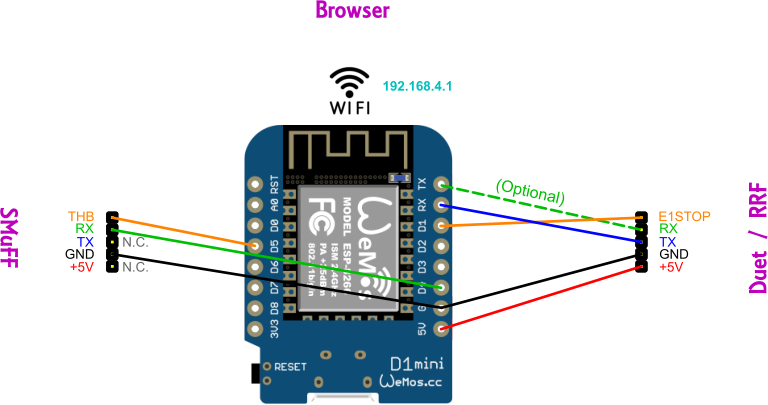

This is the firmware source code for SMuFF-Ifc2, which is used in the [SMuFF project](https://github.com/technik-gegg/SMuFF-1.1).
The IFC2 is a cheaper and simpler version of the [SMuFF-Ifc](https://github.com/technik-gegg/SMuFF-Ifc), which was built upon an ESP32 (NodeMCU) device.

In contrast to the SMuFF-Ifc, this project uses an ESP8266 (Wemos D1 mini) as the controller and since it has less capabilities, it's simpler to build and also cheaper.
The main purpose of using this interface is to add an amplifier for the serial communication lines (which can cause problems sometimes if connected directly) and also to achieve filtering of some of the data sent to the SMuFF.

---

# How to build

As you can see in the picture on top, the wiring is pretty simple and can be achieved by soldering the cables directly to the D1 mini board. Although, I'd recommend using some perfboard to do the wiring and add decent JST-XH connectors where the cables coming from SMuFF and Duet/RRF easily plug in, i.e.:

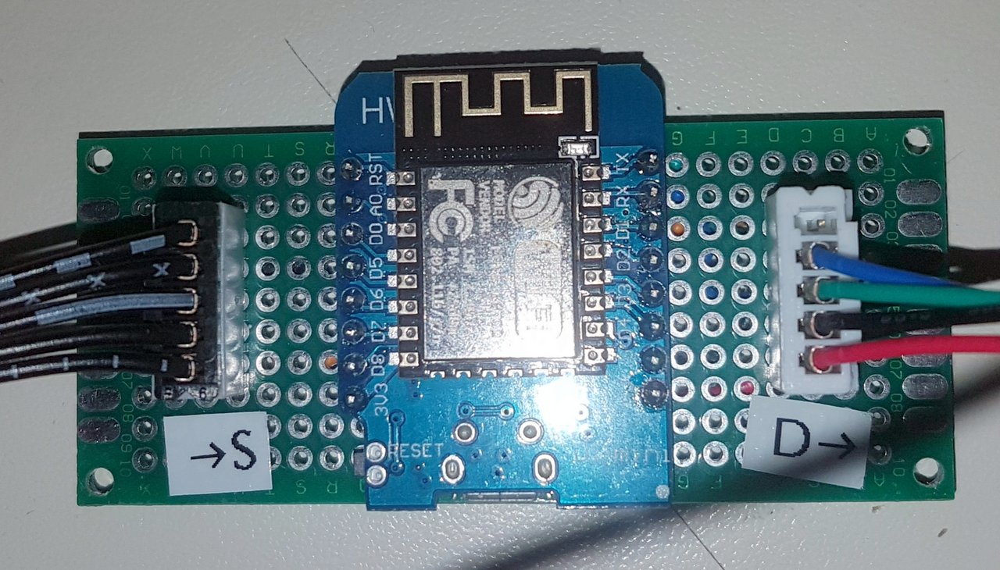
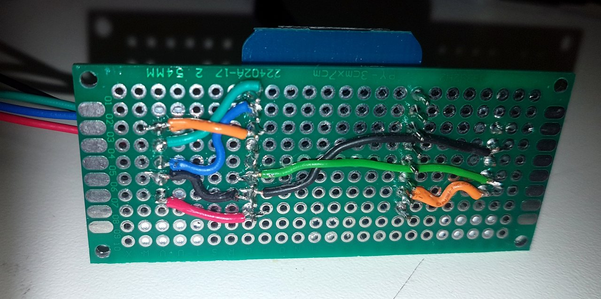

>**Pro tip:**
>
>If you don't want/have a perfboard, you have the option of soldering the headers using some extension wires directly to the WEMOS D1 mini pins.
>
>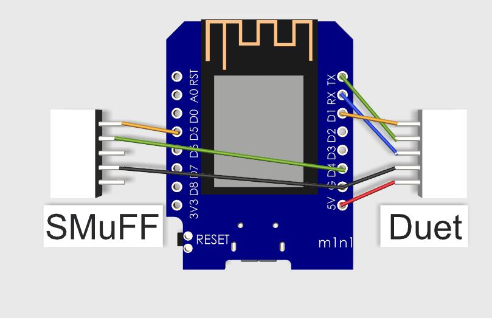
This way, you'll still have a detachable solution in a smaller form factor. Print a decent housing for it and you're golden!

As you can see, I've used 5-pin JST headers. I did this because the Duet/RRF needs an editional wire for an endstop, which is used to trigger the 'Busy' state of the SMuFF while it's changing tools ([details can be found here](https://sites.google.com/view/the-smuff/how-to/tutorials/configure-the-duet3d?authuser=0)). I'd suggest, you do the same.

>**Please beware:**
>
>Only the Duet/RRF board is supposed to power the Wemos D1 mini via the +5V wire. If you'd rather like the SMuFF controller to power the WEMOS D1, wire it up accordingly but make sure it's only **one device** that delivers power to the SMuFF-Ifc2.

---

# Web interface

The IFC2 utilizes the WiFi interface of the ESP8266 for debugging purpose.
To use this feature, you have to connect your PC to the *SMuFF-Ifc2_xxxxxx* WiFi hotspot once and allow the IFC2 to connect to your wireless network using the built-in [WiFiManager](https://github.com/tzapu/WiFiManager) via the static IP address **192.168.4.1**.

Once you have entered your network details and credentials, IFC2 will restart and connect to your WiFi network, which will eventually assign a new IP address to it. You can query your Router/Access Point in order to retrieve the new IP address or, use some network tool and look out for a device named **SMuFF-IFC2_xxxxxx**.

Use your browser to connect to this new address and you'll be greeted with this view:

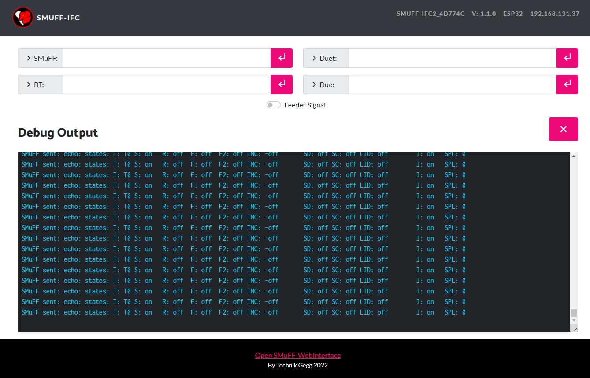

This interface will enable you to look up the debug output coming from the SMuFF-Ifc2, as well as sending GCode commands to either the SMuFF or the Duet/RRF.

*Please notice:* The input fields "BT:" and "Due:" shown in the picture above, will only show up on the ESP32 version.

>**Please keep in mind:**
>
>You'll not be able see any responses coming from the SMuFF in the *Debug Output*. That's because the ESP8266 has only the TX line available on the 2nd serial port.
>
>*In case you're curious*: This restriction is because the RX line (GPIO0) of the 2nd serial port doubles as CS pin in order to program the device via USB and therefore it's being pulled up by a resistor, which kills the receiving capabilities pretty much.
Nothing that a soldering iron and a jumper couldn't fix but it's fiddly.

If you'd like to tinker with the look and feel of this web page, the [Bootstrap Studio](https://bootstrapstudio.io/) source code is included in this repository (file *SMuFF-Ifc2.bsdesign*).

---

# Compiling / uploading

In order to compile this firmware and program it into the WEMOS D1 mini, you have to load it up in **PlatformIO** and run the *Upload* command from the **WEMOS_D1** *Project Task*.
For the very first build you also need to execute the *Upload Filesystem Image*, since the file system contains all the files needed to run the web server, as shown in the picture below.

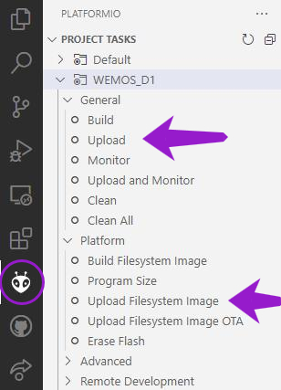

[](https://open.vscode.dev/technik-gegg/SMuFF-Ifc2/master)

---

# Connecting the device

As you connect the SMuFF-Ifc2 device between SMuFF and Duet/RRF, make sure you haven't accidentally crossed/shorted GND and +5V, **otherwise you will kill the device instantly!**

Connections are meant to be made between the **TFT** header on the SMuFF and the **PanelDue** (Duet) / **TFT** (SKR2, E3-RRF) header, as shown in the picture down below. More on that topic you'll find [in this write up](https://sites.google.com/view/the-smuff/how-to/tutorials/configure-the-duet3d?authuser=0).

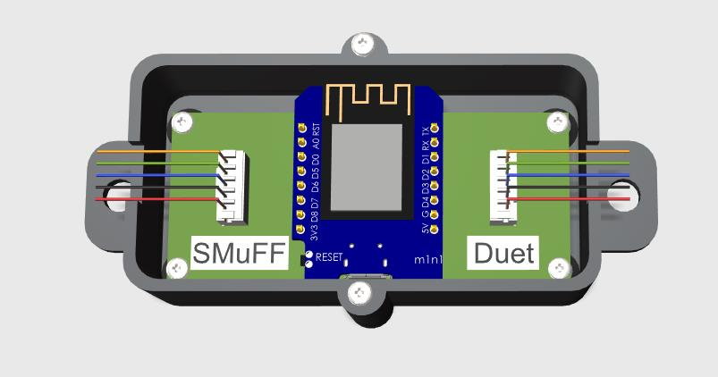

Cables are using a 1:1 connection, except for the first pin (which is RESET on the SMuFF controller, btw.). This one is supposed to connect to the **THB** signal pin on the SMuFF and the **E1STOP** signal input on the Duet (or **E1DET** on SKR2, **PWRDET** on E3-RRF).
Always use proper connectors, i.e. **JST-XH** for the E3-DIP, SKR2 controller, **Dupont** on the E3 V2.0, E3-RRF and **Molex KK** on the Duet3D controller board series.

>**Please notice:**
>
>The RX signal on the Duet/RRF side is optional because it's not really needed for the communication between SMuFF and Duet/RRF. You'll only need it if you're going to send commands from the web interface to the Duet/RRF for testing / debugging purposes.
>
>**Also:**
>Make sure both controllers serial interfaces (SMuFF and Duet/RRF) are being configured for a baud rate of **115200** baud, since this is the (hardcoded) value in the SMuFF-Ifc2 firmware.
If you need other baudrates, you have to change it in the firmware source code - see *Config.h* - of the SMuFF-Ifc2,  re-compile and re-upload the firmware.

---

## Recent changes

**1.1.1** - Added Schematic and PCB for ESP32 version

This little adapter PCB for the ESP32 DevKit / NodeMCU makes wiring up all the connectors a breeze.

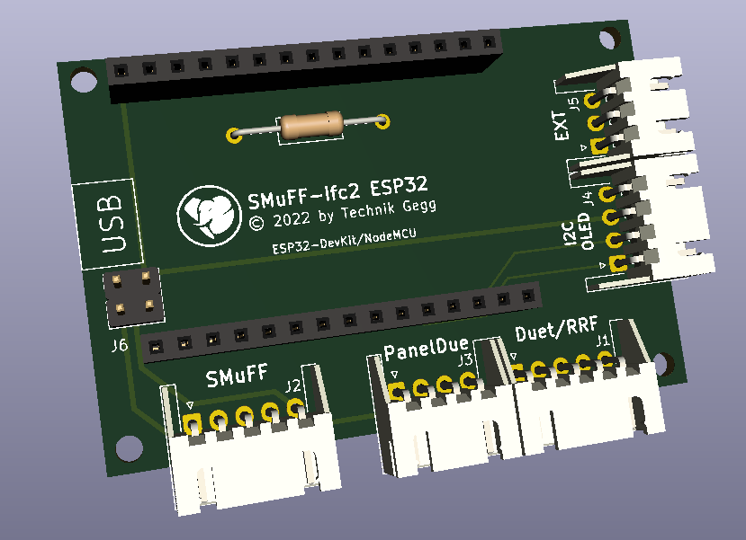
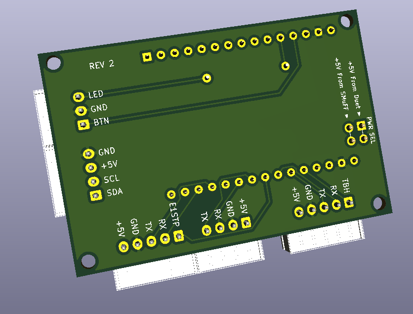

*Before you connect the PCB to your devices, please make sure you've set a jumper cap on **PWR SEL** to either "+5V From Duet" **or** "+5V From SMuFF". This jumper allows you to select the power source for the ESP32 (and the OLED display, if attached). Keep in mind: It's either the one or the other, not both.*

**1.1.0** - Added ESP32 support

The ESP32 (which has been the base for SMuFF-Ifc version 1) is the bigger brother of the ESP8266 and comes with more features, such as more serial interfaces and Bluetooth support. This enables you to use the SMuFF-Ifc as an three way splitter sitting between Duet / RRF, SMuFF and PanelDue. In addition, this device supports the SMuFF WebInterface (SMuFF-WI) when connecting via Bluetooth.
With this release, the SMuFF-Ifc version 1 has become obsolete.

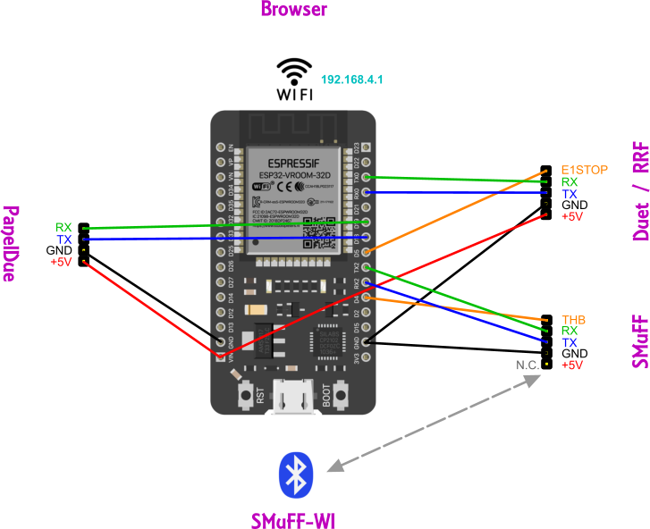

For debugging and future enhancements, the ESP32 version also comes with the option to be equipped with an OLED (I2C) display and an addtional button / LED.

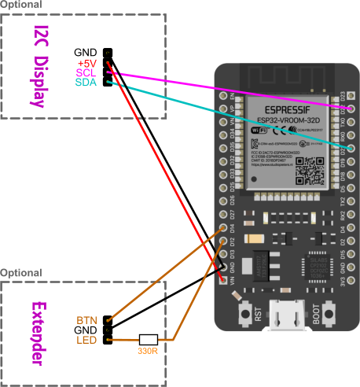

In order to compile for the ESP32, simply pick the **ESP32_Dev** Build Environment and proceed as stated in the description above.

>**Please beware**:
>
>The *serveStatic()* method on the ESP32 isn't working correctly because of [this issue](https://github.com/espressif/arduino-esp32/issues/6172)!
Thus, the web page doesn't load up correctly in your browser.
>
>In order to fix this issue, there's a quick & dirty approach, which  modifies code in the arduino-esp32 platform source. More specificly, the **_isFile = fs.exists(path);** statement needs to be replaced with **_isFile = (strrchr(path, '.') != nullptr);**, i.e.:

```CPP
class StaticRequestHandler : public RequestHandler {
public:
    StaticRequestHandler(FS& fs, const char* path, const char* uri, const char* cache_header)
    : _fs(fs)
    , _uri(uri)
    , _path(path)
    , _cache_header(cache_header)
    {
        // quick & dirty solution for issue #6172
        //_isFile = fs.exists(path);  <-- comment out this line
        _isFile = (strrchr(path, '.') != nullptr); // <-- insert this line
        log_v("StaticRequestHandler: path=%s uri=%s isFile=%d, cache_header=%s\r\n", path, uri, _isFile, cache_header ? cache_header : ""); // issue 5506 - cache_header can be nullptr
        _baseUriLength = _uri.length();
    }
```

>**Also:** This variant utilizes the latest Arduino libraries (2.0.2) and some beta platform code, which is supposed to be released in the near future.
>
>Because of this (beta), there's a known issue with the WiFiManager, not being able to connect the device to your WiFi network via its standard user interface. A valid work around is to enter the AP-Name and credentials manually in an *wifisave* request, i.e.:
>
>http://192.168.4.1/wifisave?s={SSID}&p={PWD}
>
>Replace **{SSID}** with the name of your WiFi network/Access-Point and **{PWD}** with the assoiciated password. After sending this request, the ESP32 is supposed to connect flawlessly.

**1.0.0** - Initial commit
